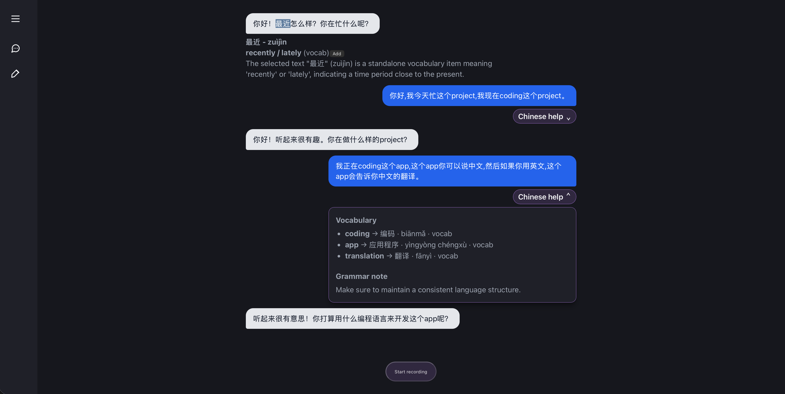
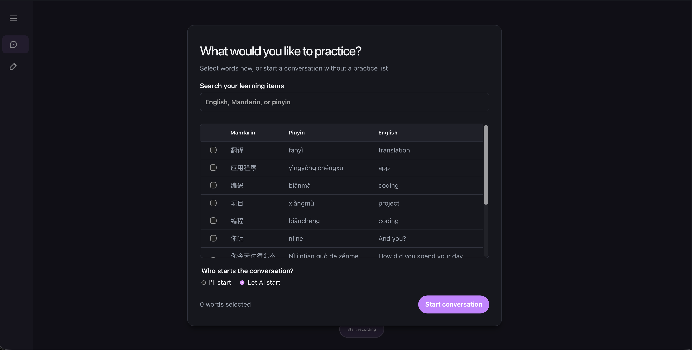
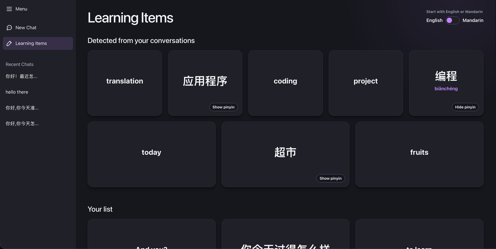

# Mandarin Conversation App

A full-stack Mandarin learning app for saving vocabulary and practising it in AI-assisted conversations.

## How it works

User conversation<br>
↓<br>
Detect English words/phrases<br>
↓<br>
Generate Mandarin + pinyin<br>
↓<br>
Save vocabulary<br>
↓<br>
Select vocabulary for practice<br>
↓<br>
Inject practice items into future AI conversations

## Tech stack

- **Frontend:** React, TypeScript, Vite, and Supabase JS
- **Backend:** FastAPI, Python, OpenAI, and Supabase
- **Database:** Supabase migrations in [`supabase/migrations`](supabase/migrations)

## Features

- Record your voice and receive an AI response.
- Highlight unfamiliar words or phrases in an assistant message, then optionally save them to your vocabulary list.
- Automatically detect English code-switching, add it to your vocabulary review list, and show its Mandarin translation and pinyin in a clickable tab.
- Choose vocabulary items to steer future conversations toward targeted practice.
- Choose whether you or the AI opens a conversation.
- Review vocabulary as flashcards for active recall practice.

## Getting started

### Prerequisites

- Node.js and npm
- Python 3.14+ and [uv](https://docs.astral.sh/uv/)
- A Supabase project
- An OpenAI API key

### 1. Configure environment variables

Create `web/.env.local`:

```env
VITE_SUPABASE_URL=https://your-project.supabase.co
VITE_SUPABASE_PUBLISHABLE_KEY=your-supabase-publishable-key
VITE_API_URL=http://localhost:8000
```

Create `be/.env`:

```env
OPENAI_API_KEY=your-openai-api-key
SUPABASE_URL=https://your-project.supabase.co
SUPABASE_SECRET_KEY=your-supabase-secret-key
```

Do not commit either environment file. Apply the SQL migrations in [`supabase/migrations`](supabase/migrations) to the Supabase project before using the app.

### 2. Start the backend

```sh
cd be
uv sync
uv run fastapi dev app/main.py
```

The API runs at <http://localhost:8000> by default.

### 3. Start the frontend

In a separate terminal:

```sh
cd web
npm install
npm run dev
```

Open the local URL printed by Vite (normally <http://localhost:5173>).

## Useful commands

```sh
# from web/
npm run lint
npm run build
```

## Screenshots
#### Chat Interface

#### Start Chat

#### Learning Items



## Project structure

```text
be/                   FastAPI API
web/                  React frontend
supabase/migrations/  Database schema migrations
docs/screenshots/     Project screenshots for this README
```
